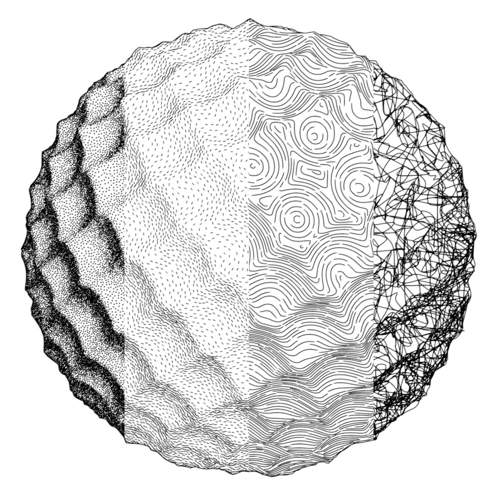
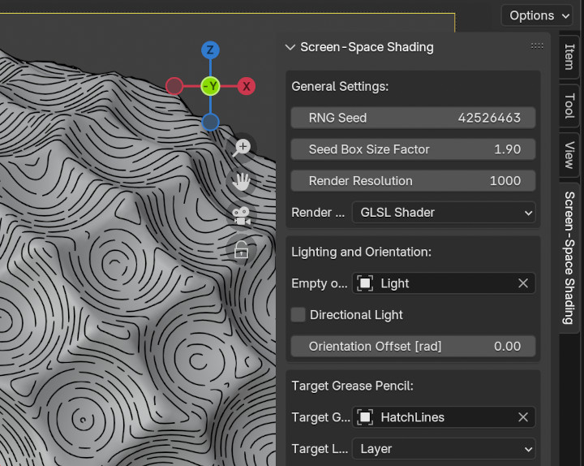

# Blender Add-On: Screen-Space Hatch Lines

This Blender 4.4+ add-on draws different screen-space shading effects of the scene as Grease Pencil v3 strokes.
It supports evenly spaced hatch lines, stipples (from points to short marks), and scribbling.

Hatch lines are computed with an algorithm following Jobard and Lefer's paper from 1997 on "Creating Evenly-Spaced Streamlines of Arbitrary Density."
Stippling uses Poisson disk sampling to achieve evenly spaced marks with a minimum separation distance based on luminance.
For scribbling, stipple points are connected by finding the nearest neighbor on a random sub-sample of points. The resulting polyline is smoothed using Catmull-Rom splines.
The input data for all the screen-space algorithms is computed either via a custom fragment shader or via Blender's native rendering engines.

## Installation

1. Download the contents of the repository as a ZIP file (Code > Download ZIP).
2. Install in Blender (tested with Blender up to version 4.5):
   - Open Blender and go to Edit > Preferences
   - Select the "Add-ons" tab
   - Select "Install from Disk..." and navigate to the downloaded ZIP file

## Usage

The shading controls can be found in the Sidebar of the 3D Viewport (press N to toggle) under the "Screen-Space Shading" tab.

## Limitations

* The GLSL render engine supports only triangle and quad faces.
* The native Blender render engine will overwrite any existing compositor node trees and will render the image multiple times to access different render passes.

## Development

Install [fake-bpy-module](https://github.com/nutti/fake-bpy-module) for code completion.

To run experiments, execute `run_experiment_from_blender.py` from within Blender's script editor. This will execute `experiment.py` in Blender's Python environment.
